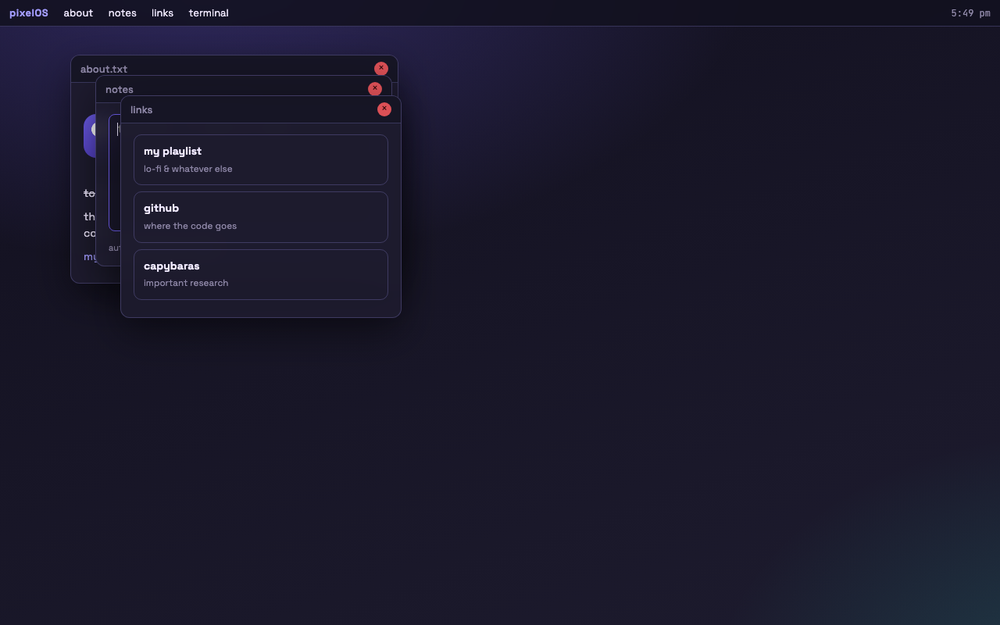

# devlog 2 — windows actually drag

big day. the welcome page is dead, long live the desktop.

- moved the old welcome content into an "about.txt" window so nothing was wasted
- top bar with the OS name, menus for each app, and a working clock (setInterval, updates every second)
- windows: open, close, click-to-focus (z-index goes up each time so the clicked one is on top)
- dragging via pointer events on the title bar. locked the top at 34px so you can't
  drag a window behind the menu bar
- 4 apps so far: about, notes, links, terminal

the notes app autosaves to localStorage while you type (debounced) and shows
"saved at 5:45 pm" when it writes. terminal has help / whoami / date / open / clear /
sudo (denied obviously) and a capybara command.

also learned the hard way that missing `<meta charset>` turns every middle dot into
"·". fixed. next: make it feel less like the guide's version — i want themes.
