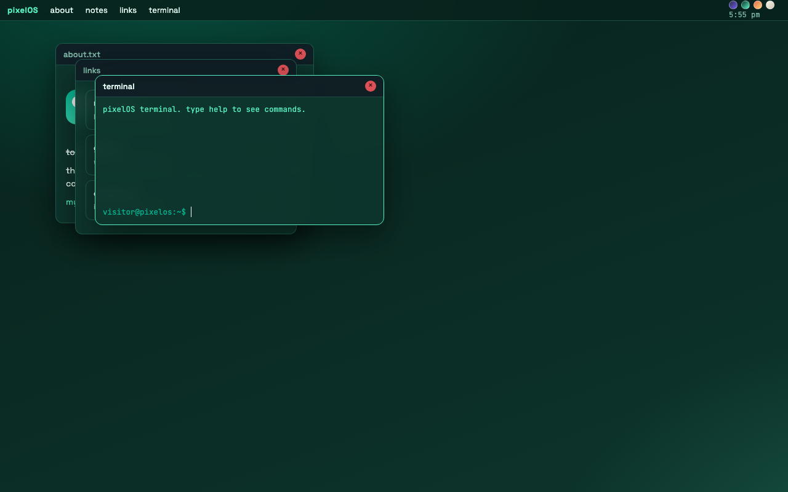

# devlog 3 — themes + polish

the feature the guide never asked for: **theme switching**. four swatches in the top
bar (night / mint / sunset / paper), whole OS recolors instantly through css variables,
and your pick is remembered in localStorage so it survives refresh.

what that took:
- every color in the OS now lives in ~12 css variables, including the wallpaper glows
  (this was the annoying part — the purple glow was hardcoded and followed me into every theme)
- "paper" is a light theme which forced me to fix a bunch of colors that only worked on dark
- focus rings on windows now use the accent color so the active window reads correctly in all themes

bonus stuff:
- you can deep link apps: `index.html#notes,term` opens those at boot
- same trick for themes: `?theme=mint` in the url forces one (nice for sharing a link that looks right)
- per-app window widths (terminal is wider, links narrower)

it finally feels like *my* OS and not the tutorial's. requirements i think i've hit:
multiple draggable windows ✓, no password ✓, a feature the guide didn't list ✓.
